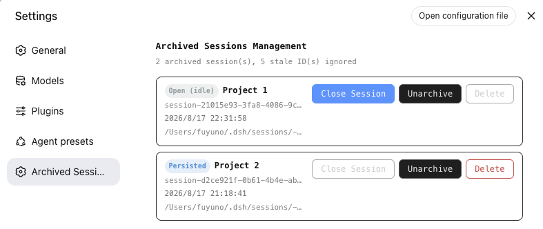

# @dsh-external/dsh-archive-session

[English](README.md) | [中文](README.zh.md)

A DSH plugin for browsing archived sessions and safely deleting them.

DSH officially supports archiving sessions, but it does not provide a way to view archived sessions, close them from memory, unarchive them, or delete them. This plugin fills that gap.

## Features

- **Browse archived sessions**
  - Lists sessions in the registry-global archive set with title, session ID, workspace path, creation time, live/running/persisted status, and log path.
- **Close in-memory sessions without restarting DSH**
  - A finished conversation can still be held in memory by DSH. `archived_session_close` flushes and detaches an idle session so it becomes persisted-only immediately.
- **Unarchive sessions**
  - Removes a session from the archive set so it reappears in the sidebar/grouping surfaces and can be closed normally.
- **Delete archived sessions**
  - Physically removes the session log directory for JSONL backends after explicit confirmation.
- **Settings UI**
  - A dedicated **Archived Sessions** page under DSH Web Settings.
- **Host HTTP API**
  - Simple JSON endpoints for automation.



## Agent Tools

| Tool | Description |
| --- | --- |
| `archived_sessions_list` | List archived sessions that still resolve to a real session. |
| `archived_session_close` | Close an idle in-memory archived session (flush + detach), no restart required. |
| `archived_session_unarchive` | Remove a session from the archive set so it becomes visible again in the sidebar. |
| `archived_session_delete` | Delete an archived session permanently. Requires `confirm: true`. |

## Settings UI

Open DSH Web Settings and select **Archived Sessions**.

Each row shows:

- Title / session name
- Session ID and workspace path (full value on hover)
- Creation time
- Full log path
- Status badge: `Running`, `Open (idle)`, or `Persisted`

Available actions per row:

- **Close session** – turn an idle in-memory session into persisted-only
- **Unarchive** – make the session visible again in the sidebar
- **Delete** – permanently delete the session (enabled only after it is persisted-only)

## Host API

Base path: `/dsh-archive-session/api`

| Method | Path | Body | Description |
| --- | --- | --- | --- |
| GET | `/archived` | – | List archived sessions. |
| POST | `/close` | `{ "sessionId": "..." }` | Close an idle in-memory session. |
| POST | `/unarchive` | `{ "sessionId": "..." }` | Remove a session from the archive set. |
| POST | `/delete` | `{ "sessionId": "...", "confirm": true }` | Permanently delete an archived session. |

## Installation

### Prerequisites

- A DSH installation with the `dsh` CLI available, or the DSH source checkout for building.
- Node.js and npm for building from source.

### Install from a release tarball

```bash
dsh plugin --profile web add dsh-external-dsh-archive-session-0.0.9.tgz
```

After installation, restart DSH.

### Install from source

```bash
git clone https://github.com/DreamStan/dsh-archive-session.git dsh-archive-session
cd dsh-archive-session

# Build host + client
bash scripts/build.sh
npm run build:client

# Pack a distributable tarball
npm pack

# Install into the web profile
dsh plugin --profile web add ./dsh-external-dsh-archive-session-0.0.9.tgz
```

If you use the DSH super-injector development toolchain, you can also run:

```bash
dev_build_plugin  {"dir": "/absolute/path/to/dsh-archive-session"}
dev_install_package {"dir": "/absolute/path/to/dsh-archive-session"}
```

### Manual profile installation

Add the dependency and bundle entry to `~/.dsh/profiles/web/package.json`:

```json
{
  "dependencies": {
    "@dsh-external/dsh-archive-session": "link:/absolute/path/to/dsh-archive-session"
  },
  "dsh": {
    "profile": {
      "bundles": [
        "@deepseek-ai/dsh-base",
        "@deepseek-ai/dsh-web-app",
        "@dsh-external/dsh-archive-session"
      ]
    }
  }
}
```

Then create the profile link:

```bash
mkdir -p ~/.dsh/profiles/web/node_modules/@dsh-external
ln -s /absolute/path/to/dsh-archive-session ~/.dsh/profiles/web/node_modules/@dsh-external/dsh-archive-session
```

Restart DSH.

## Uninstallation

### Via dsh CLI

```bash
dsh plugin --profile web remove @dsh-external/dsh-archive-session
```

Restart DSH after removal.

### Via super-injector dev tools

If the plugin was installed with the DSH super-injector toolchain:

```bash
dev_uninject_plugin {"match": "dsh-archive-session"}
```

### Manual removal

1. Remove the dependency and bundle entry from `~/.dsh/profiles/web/package.json`:

```json
{
  "dependencies": {
    "@dsh-external/dsh-super-injector": "link:/path/to/dsh-super-injector"
  },
  "dsh": {
    "profile": {
      "bundles": [
        "@deepseek-ai/dsh-base",
        "@deepseek-ai/dsh-web-app",
        "@dsh-external/dsh-super-injector"
      ]
    }
  }
}
```

2. Remove the profile link:

```bash
rm -f ~/.dsh/profiles/web/node_modules/@dsh-external/dsh-archive-session
```

3. If a disabled patch entry for this plugin exists in `~/.dsh/profiles/web/cordis.patch.yml`, remove it.

4. Restart DSH.

> Uninstalling the plugin does **not** delete archived session logs or workspace data.

## Usage Notes

- **Close before delete.** DSH keeps session objects in memory after a conversation ends. You must either restart DSH or use `archived_session_close` before deleting a live-idle session.
- **Unarchive to manage normally.** Archived sessions are hidden from the sidebar. Use `archived_session_unarchive` if you want to open, close, or resume them through the normal UI.
- **Stale archive IDs are ignored.** If an archived ID no longer resolves to a real session log, it is skipped and reported as an ignored stale ID.
- **Deletion backend support.** Deletion currently works with the JSONL persistence backend (`~/.dsh/sessions`). SQLite backends are rejected with a clear error because DSH exposes no public deletion API for them.

## License

[MIT](LICENSE)
