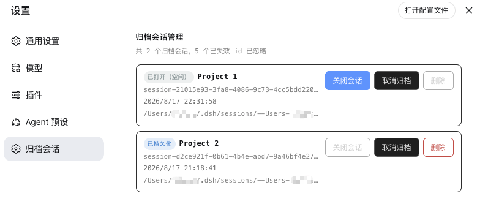

# @dsh-external/dsh-archive-session

[English](README.md) | [中文](README.zh.md)

DSH 插件：浏览归档会话，并安全地关闭、取消归档或删除会话。

DSH 官方目前只有“归档会话”的能力，但没有查看归档会话、从内存中关闭会话、取消归档或删除会话的入口。本插件补齐这些缺口。

## 功能简介

- **浏览归档会话**
  - 列出注册表全局归档集合中的会话，包含标题、会话 ID、工作区路径、创建时间、live/running/persisted 状态和日志路径。
- **无需重启 DSH 即可关闭内存中的会话**
  - DSH 在对话结束后仍会把会话保留在内存中。`archived_session_close` 会先 flush 再 detach，让空闲会话立即变为“已持久化”。
- **取消归档**
  - 将会话从归档集合移除，使其重新出现在侧边栏/分组视图中，方便正常打开、关闭或继续。
- **删除归档会话**
  - 显式确认后，物理删除 JSONL 后端的会话日志目录。
- **设置页 UI**
  - 在 DSH Web 设置中新增「归档会话」页面。
- **Host HTTP API**
  - 提供简单的 JSON 接口，方便自动化。



## Agent 工具

| 工具 | 说明 |
| --- | --- |
| `archived_sessions_list` | 列出仍能对应到真实会话的归档会话。 |
| `archived_session_close` | 关闭一个空闲的内存归档会话（flush + detach），无需重启。 |
| `archived_session_unarchive` | 将会话移出归档集合，使其重新出现在侧边栏。 |
| `archived_session_delete` | 永久删除归档会话，必须传 `confirm: true`。 |

## 设置页 UI

打开 DSH Web 设置，选择 **归档会话**。

每个条目显示：

- 标题 / 会话名
- 会话 ID 和工作区路径（悬停可查看完整内容）
- 创建时间
- 完整日志路径
- 状态徽标：`运行中`、`已打开（空闲）` 或 `已持久化`

每个条目支持的操作：

- **关闭会话**：把空闲的内存会话变为“已持久化”
- **取消归档**：让会话重新出现在侧边栏
- **删除**：永久删除会话（仅在已持久化后可用）

## Host API

基础路径：`/dsh-archive-session/api`

| 方法 | 路径 | Body | 说明 |
| --- | --- | --- | --- |
| GET | `/archived` | – | 列出归档会话。 |
| POST | `/close` | `{ "sessionId": "..." }` | 关闭空闲的内存会话。 |
| POST | `/unarchive` | `{ "sessionId": "..." }` | 将会话移出归档集合。 |
| POST | `/delete` | `{ "sessionId": "...", "confirm": true }` | 永久删除归档会话。 |

## 安装

### 前置要求

- 已安装 DSH，且 `dsh` CLI 可用；从源码构建时需要 DSH 源码目录。
- 从源码构建需要 Node.js 和 npm。

### 从发布包安装

```bash
dsh plugin --profile web add dsh-external-dsh-archive-session-0.0.9.tgz
```

安装后重启 DSH。

### 从源码安装

```bash
git clone https://github.com/DreamStan/dsh-archive-session.git dsh-archive-session
cd dsh-archive-session

# 构建 host + client
bash scripts/build.sh
npm run build:client

# 打包可分发 tgz
npm pack

# 安装到 web profile
dsh plugin --profile web add ./dsh-external-dsh-archive-session-0.0.9.tgz
```

如果使用 DSH super-injector 开发工具链，也可以：

```bash
dev_build_plugin  {"dir": "/absolute/path/to/dsh-archive-session"}
dev_install_package {"dir": "/absolute/path/to/dsh-archive-session"}
```

### 手动修改 profile 安装

编辑 `~/.dsh/profiles/web/package.json`：

```json
{
  "dependencies": {
    "@dsh-external/dsh-archive-session": "link:/absolute/path/to/dsh-archive-session"
  },
  "dsh": {
    "profile": {
      "bundles": [
        "@deepseek-ai/dsh-base",
        "@deepseek-ai/dsh-web-app",
        "@dsh-external/dsh-archive-session"
      ]
    }
  }
}
```

创建 profile 链接：

```bash
mkdir -p ~/.dsh/profiles/web/node_modules/@dsh-external
ln -s /absolute/path/to/dsh-archive-session ~/.dsh/profiles/web/node_modules/@dsh-external/dsh-archive-session
```

重启 DSH。

## 卸载

### 通过 dsh CLI

```bash
dsh plugin --profile web remove @dsh-external/dsh-archive-session
```

卸载后重启 DSH。

### 通过 super-injector 开发工具

如果是通过 DSH super-injector 工具链安装的：

```bash
dev_uninject_plugin {"match": "dsh-archive-session"}
```

### 手动卸载

1. 从 `~/.dsh/profiles/web/package.json` 中移除依赖和 bundle 条目：

```json
{
  "dependencies": {
    "@dsh-external/dsh-super-injector": "link:/path/to/dsh-super-injector"
  },
  "dsh": {
    "profile": {
      "bundles": [
        "@deepseek-ai/dsh-base",
        "@deepseek-ai/dsh-web-app",
        "@dsh-external/dsh-super-injector"
      ]
    }
  }
}
```

2. 删除 profile 链接：

```bash
rm -f ~/.dsh/profiles/web/node_modules/@dsh-external/dsh-archive-session
```

3. 如果 `~/.dsh/profiles/web/cordis.patch.yml` 中存在本插件的 disabled 条目，一并删除。

4. 重启 DSH。

> 卸载插件**不会**删除已归档的会话日志或 Workspace 数据。

## 使用说明

- **先关闭再删除。** DSH 在对话结束后仍会把会话对象保留在内存中。删除一个“已打开（空闲）”的会话前，需要先重启 DSH，或使用 `archived_session_close` 将其变为“已持久化”。
- **取消归档后可正常管理。** 归档会话会从侧边栏隐藏。如果希望通过普通界面打开、关闭或继续某个会话，先使用 `archived_session_unarchive`。
- **失效归档 ID 会被忽略。** 如果归档集合中的某个 ID 已无法对应到真实会话日志，插件会跳过它，并显示为已忽略的失效 ID。
- **删除后端支持。** 当前删除功能支持 JSONL 持久化后端（默认 `~/.dsh/sessions`）。SQLite 后端会明确报错，因为 DSH 没有公开的删除 API。

## License

[MIT](LICENSE)
